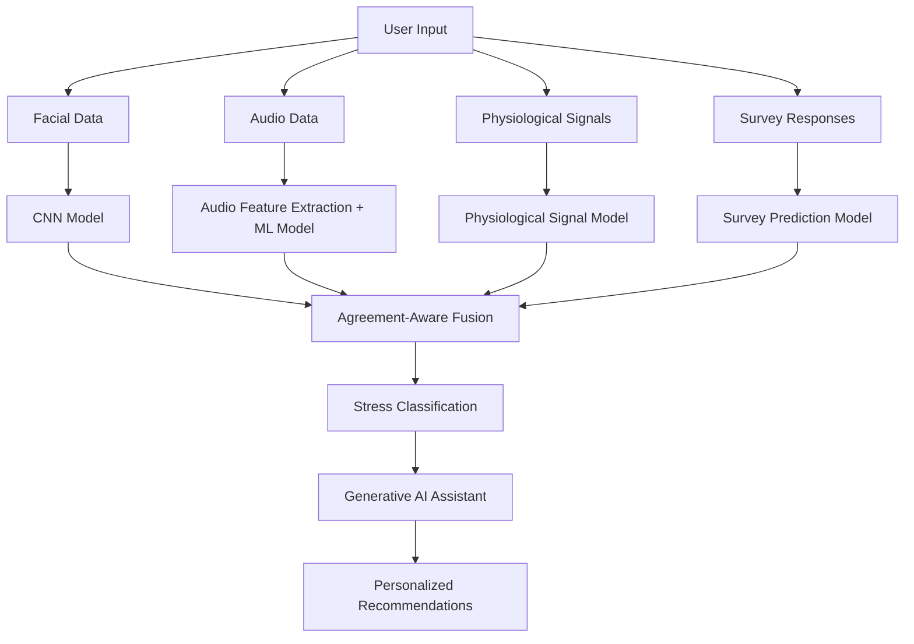

# SafeSpace - AI Powered Multimodal Stress Detection Platform

SafeSpace is a full-stack AI application designed to detect stress levels by analyzing multiple human indicators including physiological signals, facial expressions, speech patterns, and psychological responses.

The platform combines **Machine Learning, Deep Learning, Wearable Sensor Data, and Generative AI** to provide stress classification along with personalized wellness recommendations.

**Live Demo:** https://safespac-ai-4.netlify.app/

---

## Overview

Traditional stress detection systems often rely on a single input source, which may not accurately represent a person's mental state.

SafeSpace addresses this limitation using a **multimodal AI approach**, where multiple independent models analyze different stress indicators and their predictions are combined using an **Agreement-Aware Fusion mechanism**.

The system focuses on:

- Real-time stress prediction
- Multiple modality-based analysis
- Reliable decision-level fusion
- AI-driven personalized recommendations

---

## Key Features

- Multimodal stress analysis using physiological, visual, audio, and survey data
- Facial stress recognition using deep learning models
- Speech-based emotion analysis using audio feature extraction
- Wearable sensor-based physiological monitoring
- Psychological assessment using questionnaire responses
- Agreement-Aware Fusion for improved prediction reliability
- AI-powered personalized stress management suggestions
- Interactive React-based web application

---

## System Architecture

SafeSpace follows a modular architecture where each modality is processed independently before generating the final stress prediction.

---

## Tech Stack

| Category | Technologies |
|---------|--------------|
| Frontend | React.js, TypeScript, Vite, Tailwind CSS |
| Backend & Database | Supabase, API Integration |
| Machine Learning | Python, TensorFlow, PyTorch, Scikit-learn |
| Computer Vision | OpenCV, CNN |
| Audio Processing | Librosa, MFCC Feature Extraction |
| Data Processing | NumPy, Pandas |
| Generative AI | Hugging Face Transformers, Phi-2 LLM |
| Hardware | ESP32, EDA Sensor, MAX30102, Temperature Sensor |

---

## Dataset Information

The system uses multiple datasets corresponding to different stress indicators.

| Modality | Dataset | Information |
|---------|---------|-------------|
| Physiological Signals | WorkStress3D | Wearable sensor-based physiological data |
| Facial Expressions | WorkStress3D Images | Facial emotion patterns |
| Audio Signals | RAVDESS | Emotional speech recordings |
| Psychological Data | DASS-21 | Stress questionnaire responses |

---

## Models Used

| Component | Approach |
|----------|----------|
| Facial Analysis | CNN-based image classification |
| Audio Analysis | MFCC feature extraction with deep learning |
| Physiological Analysis | Deep Neural Network classifier |
| Survey Analysis | Neural network-based prediction |
| Recommendation System | Large Language Model based response generation |

---

## Multimodal Fusion

SafeSpace uses **Agreement-Aware Fusion (AAF)** to combine predictions from different modalities instead of relying on a single model.

The fusion mechanism:

- Compares confidence scores from individual models
- Identifies agreement between different modalities
- Reduces dependency on unreliable predictions
- Generates the final stress classification

This improves robustness compared to traditional single-input stress detection systems.

---
