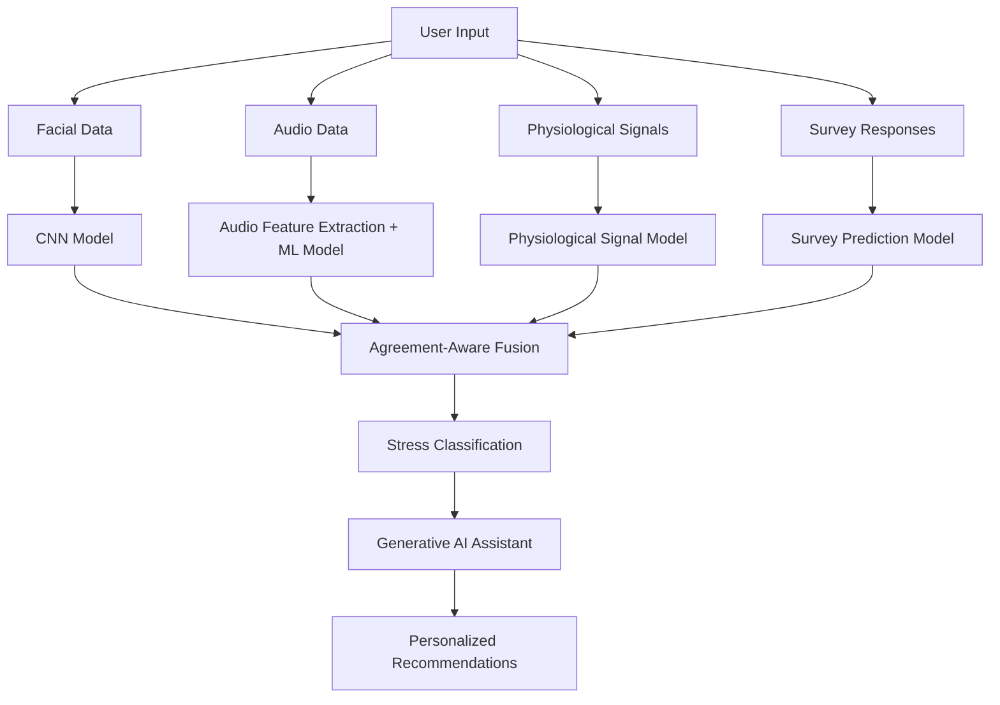

# SafeSpace - AI Powered Multimodal Stress Detection Platform

SafeSpace is a full-stack AI application designed to detect stress levels by analyzing multiple human indicators including physiological signals, facial expressions, speech patterns, and psychological responses.

The platform combines **Machine Learning, Deep Learning, Wearable Sensor Data, and Generative AI** to provide stress classification along with personalized wellness recommendations.

**Live Demo:** https://safespac-ai-4.netlify.app/

---

## Overview

Traditional stress detection systems often rely on a single input source, which may not accurately represent a person's mental state.

SafeSpace addresses this limitation using a **multimodal AI approach**, where multiple independent models analyze different stress indicators and their predictions are combined using an **Agreement-Aware Fusion mechanism**.

The system focuses on:

- Real-time stress prediction
- Multiple modality-based analysis
- Reliable decision-level fusion
- AI-driven personalized recommendations

---

## Key Features

- Multimodal stress analysis using physiological, visual, audio, and survey data
- Facial stress recognition using deep learning models
- Speech-based emotion analysis using audio feature extraction
- Wearable sensor-based physiological monitoring
- Psychological assessment using questionnaire responses
- Agreement-Aware Fusion for improved prediction reliability
- AI-powered personalized stress management suggestions
- Interactive React-based web application

---

## System Architecture

SafeSpace follows a modular architecture where each modality is processed independently before generating the final stress prediction.



---

## Tech Stack

| Category | Technologies |
|---------|--------------|
| Frontend | React.js, TypeScript, Vite, Tailwind CSS |
| Backend & Database | Supabase, API Integration |
| Machine Learning | Python, TensorFlow, PyTorch, Scikit-learn |
| Computer Vision | OpenCV, CNN |
| Audio Processing | Librosa, MFCC Feature Extraction |
| Data Processing | NumPy, Pandas |
| Generative AI | Hugging Face Transformers, Phi-2 LLM |
| Hardware | ESP32, EDA Sensor, MAX30102, Temperature Sensor |

---

## Dataset Information

The system uses multiple datasets corresponding to different stress indicators.

| Modality | Dataset | Information |
|---------|---------|-------------|
| Physiological Signals | WorkStress3D | Wearable sensor-based physiological data |
| Facial Expressions | WorkStress3D Images | Facial emotion patterns |
| Audio Signals | RAVDESS | Emotional speech recordings |
| Psychological Data | DASS-21 | Stress questionnaire responses |

---

## Models Used

| Component | Approach |
|----------|----------|
| Facial Analysis | CNN-based image classification |
| Audio Analysis | MFCC feature extraction with deep learning |
| Physiological Analysis | Deep Neural Network classifier |
| Survey Analysis | Neural network-based prediction |
| Recommendation System | Large Language Model based response generation |

---

## Multimodal Fusion

SafeSpace uses **Agreement-Aware Fusion (AAF)** to combine predictions from different modalities instead of relying on a single model.

The fusion mechanism:

- Compares confidence scores from individual models
- Identifies agreement between different modalities
- Reduces dependency on unreliable predictions
- Generates the final stress classification

This improves robustness compared to traditional single-input stress detection systems.

---

## Project Workflow

The SafeSpace workflow follows an end-to-end AI pipeline from data collection to personalized recommendations.

1. **Data Collection**
   - Collects inputs from facial images, speech recordings, physiological sensors, and survey responses.

2. **Data Preprocessing**
   - Processes each modality using suitable preprocessing techniques:
     - Image resizing and normalization
     - MFCC extraction from audio
     - Physiological signal scaling
     - Survey response encoding

3. **Model Prediction**
   - Each modality-specific deep learning model generates an independent stress prediction.

4. **Fusion Layer**
   - Agreement-Aware Fusion combines individual predictions to calculate the final stress score.

5. **Recommendation Generation**
   - The AI assistant generates personalized stress management suggestions based on the detected stress level.

---

## Results & Evaluation

Individual models were trained and evaluated separately before applying multimodal fusion.

| Model | Evaluation Result |
|------|------------------|
| Physiological Signal Model | 82% Accuracy |
| Facial Expression Model | 83% Accuracy |
| Survey-Based Model | 90% Accuracy |
| Audio-Based Model | 94% Accuracy |

The multimodal approach improves reliability by combining different stress indicators instead of depending on a single source of information.

---

## Model Performance Metrics

| Modality | Precision | Recall | F1-Score |
|---------|----------|--------|---------|
| Physiological | 0.82 | 0.77 | 0.79 |
| Facial Expression | 0.83 | 0.83 | 0.83 |
| Survey | 0.91 | 0.91 | 0.90 |
| Audio | 0.94 | 0.94 | 0.94 |

---

## Project Structure

```
SafeSpace/
│
├── AIModel/
│   ├── saved_models/
│   └── model scripts
│
├── src/
│   ├── components/
│   ├── pages/
│   ├── hooks/
│   ├── App.tsx
│   └── main.tsx
│
├── supabase/
│   └── functions/
│
├── public/
│
├── package.json
├── README.md
└── vite.config.ts
```

---

## Installation & Setup

Clone the repository:

```bash
git clone https://github.com/aasthagarg-01/SafeSpace.git
```

Navigate to the project directory:

```bash
cd safe-space
```

Install dependencies:

```bash
npm install
```

Start the development server:

```bash
npm run dev
```

The application will run locally at:

```text
http://localhost:5173/
```

---

## Usage

Users can access SafeSpace through the deployed web application:

https://safespac-ai-4.netlify.app/

The application allows users to:

- Provide stress-related inputs
- Analyze stress indicators using AI models
- Receive stress predictions
- Get personalized wellness recommendations

---

## Limitations

- Model performance depends on the quality and diversity of input data, as variations in sensor readings, audio quality, and facial conditions can affect prediction accuracy.
- Real-world performance can be further improved by validating the system on larger and more diverse user groups.

---

## Future Improvements

- Enhance multimodal fusion using advanced deep learning techniques for more adaptive stress prediction.
- Optimize models for real-time wearable device integration.
- Improve AI-generated recommendations by incorporating more personalized user context.
  
---

## References

This project is based on research and open-source technologies in multimodal stress detection, deep learning, and AI-based mental wellness systems.

- WorkStress3D Dataset
- RAVDESS Emotional Speech Dataset
- DASS-21 Psychological Assessment Dataset
- TensorFlow & PyTorch Deep Learning Frameworks
- Hugging Face Transformers
- Supabase Documentation
